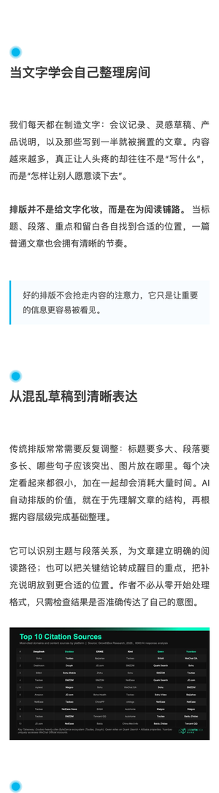
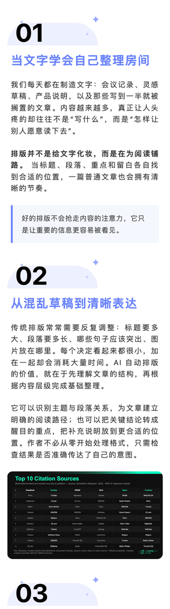
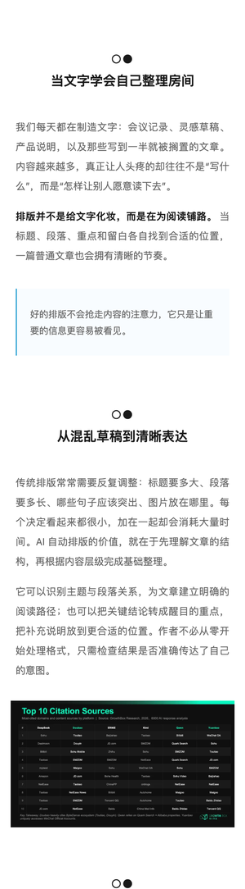
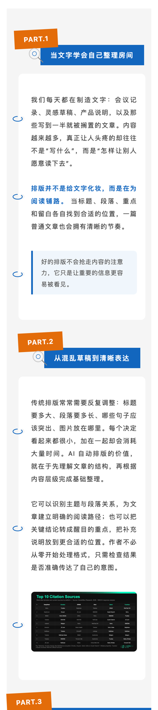
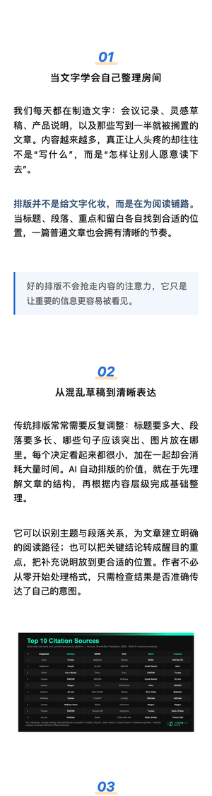
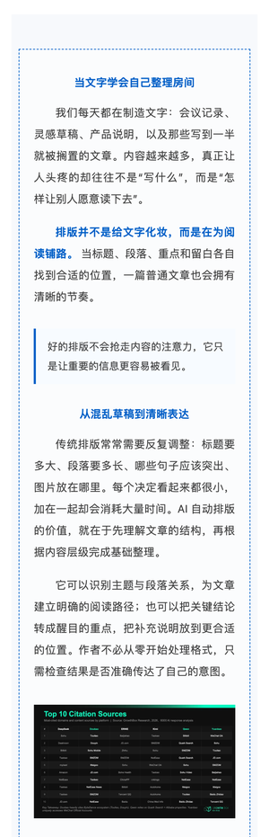

# Ryan WeChat Publisher

**公众号文章排版发布助手** —— 把一篇普通的 Markdown / Word 文章，变成一篇好看的公众号文章，并直接送进你的公众号草稿箱。

---

## 🖼️ 排版效果预览

| | | |
|---|---|---|
|  |  |  |
|  |  |  |

---

## ✨ 它能做什么

### 1. 内置多套排版模板，一键套用

不用懂任何代码，选一套风格就能排：

| 预设 | 风格 |
|------|------|
| 蓝点笔记 | 清爽的蓝色圆点笔记风 |
| 蓝紫徽章 | 徽章式标题 + 蓝紫配色 |
| 极简雅致 | 克制留白，适合深度长文 |
| 活力徽章 | 彩色徽章，活泼吸睛 |
| 极客科技 | 深色代码感，技术文章首选 |
| 公众号蓝黄线框 | 经典公众号框架感 |
| 童趣手绘 | 动态笔刷标题、手绘数字与多色高亮 |

### 2. 复刻你喜欢的公众号排版

看到别人家的文章排版好看？把链接丢过来，它会把那套风格"抄"下来，套在你的文章上。

### 3. 直接发布到你的公众号

排版完成后，自动上传图片、生成草稿，你只需要去公众号后台点一下"发布"。

---

## 🚀 怎么安装

**直接复制下面的 prompt 给 AI 助手。**

举个例子，你可以对 Workbuddy、Kimi Work、Claude Code 或 Codex 说：

```text
帮我安装这个 skill，这是它的 GitHub 链接：
https://github.com/RyanChen1997/ryan-wechat-publisher
```

---

## 📖 怎么使用

**不需要学任何命令。** 直接跟你的 AI 说人话，比如：

**例 1：用内置模板排版并发布**
```text
请帮我把 /Users/me/文章.docx 排版并发布到公众号，用「极简雅致」风格
```

**例 2：复刻别人的排版再发布**
```text
请照这篇公众号文章的风格帮我排版：
https://mp.weixin.qq.com/s/xxxxx
内容是我桌面的 我的文章.md
```

**例 3：只要排版，不发布**
```text
把这篇文章排版成公众号格式，先给我预览，我确认后再发布
```

AI 会引导你一步步确认（选风格 → 确认排版 → 预览 → 发布），全程只需要回答"可以 / 换一套 / 用第三个标题"。
